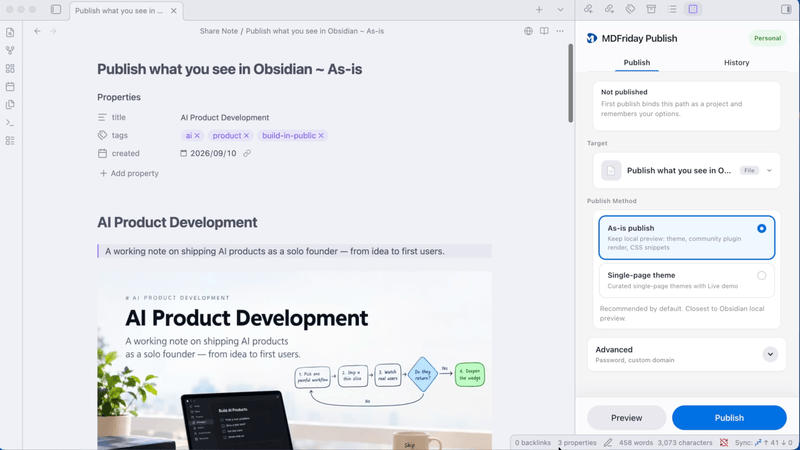
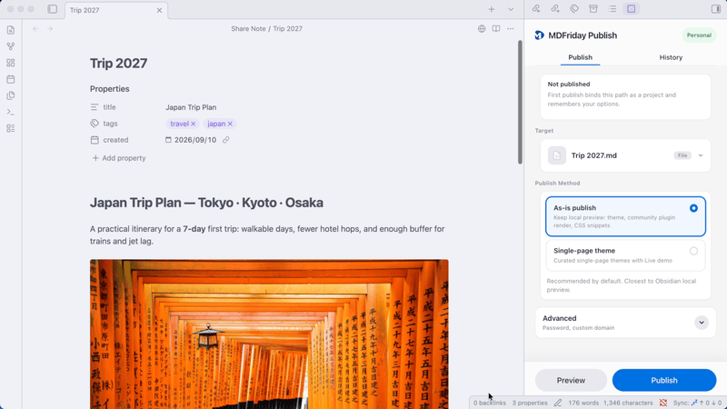
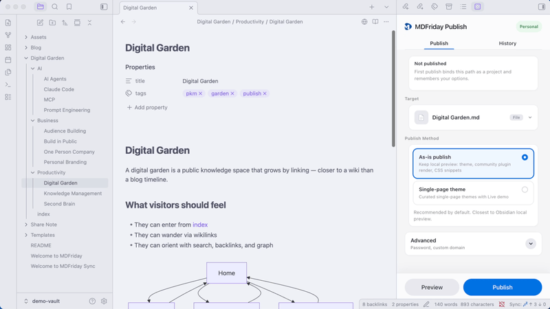

# MDFriday Publish

**One click. Turn notes into websites.**

Publish a note or a folder from Obsidian as a website. No Git. No GitHub. No build pipelines. Just right click and publish.

## Help us improve MDFriday Publish

- Discord: https://discord.gg/t9F93FChT

## Publish a note exactly as you see it in Obsidian

## Publish a note with selected theme

## Publish a folder as a Wiki

## Why MDFriday Publish?

Obsidian is great for creating knowledge.
Sharing that knowledge is often much harder.
Many publishing solutions require:

* Git
* GitHub
* Static site generators
* Deployment workflows
* Theme configuration

MDFriday Publish removes that complexity.
Publish directly from Obsidian with a single click.

## Learn More

- Website: https://mdfriday.com
- Documentation: https://help.mdfriday.com
- GitHub: https://github.com/mdfriday

## License

Apache 2.0
