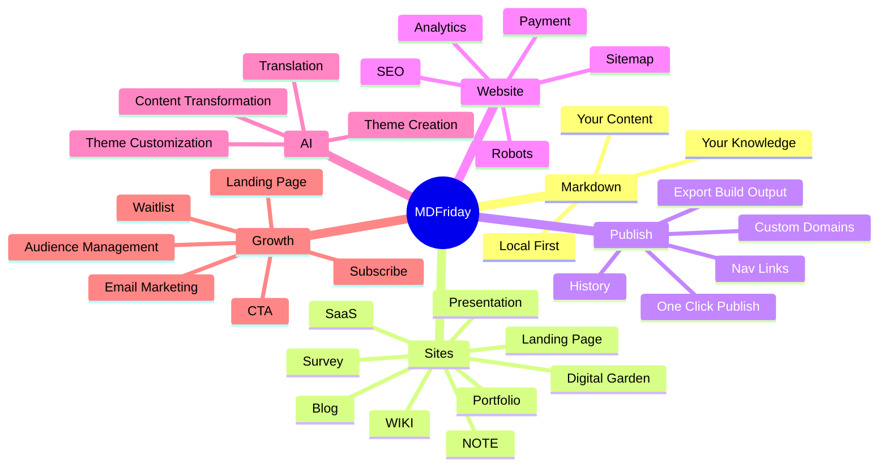

# MDFriday Product Map

> **MD + Theme = Sites**
>
> Turn the Markdown you already own into websites, then turn those websites into businesses.

MDFriday is a local-first platform for turning Markdown knowledge into different kinds of websites.

## 1. The Big Picture



## 2. The Core Model

MDFriday is built around one simple abstraction:

```text
                  Markdown
                     │
                     ▼
                   Theme
                     │
       ┌─────────────┼─────────────┐
       ▼             ▼             ▼
     Layout       Components    Interaction
       │             │             │
       └─────────────┼─────────────┘
                     ▼
                    Site
```

The Markdown contains the **content**. The Theme defines how that content becomes a **specific web experience**.

This means users do not need to learn a different publishing system for every type of site. And the system can grow to support new site types without requiring users to learn a new publishing model.

## 3. AI's Role

AI is an important part of MDFriday, but it is not the product itself.

MDFriday's AI strategy is intentionally focused on **content transformation and presentation customization**.

The user's Markdown should remain the source of truth. Users should not have to rewrite their Markdown just because a Theme expects a particular structure or presentation.

Instead, AI can work between the user's original content and the final presentation layer:

```text
                 YOUR ORIGINAL MD
                        │
                        ▼
                       AI
                        │
          ┌─────────────┼─────────────┐
          │             │             │
      Transform     Translate      Design
          │             │             │
          ▼             ▼             ▼
   Theme-compatible  Other     Create / Customize
       content      languages       Theme
          │             │             │
          └─────────────┬─────────────┘
					    ▼
					  Theme
					    │
					    ▼
					   Site
```

## 4. From SSG to Site Platform

Static Site Generation is the foundation. It is not the destination.

The basic SSG model is:

```text
Markdown
   ↓
Build
   ↓
HTML / CSS / JS
   ↓
Static Site
```

MDFriday starts here because it provides a simple, portable, local-first foundation.

But a real website often needs more.

```text
                         SITE
                          │
             ┌────────────┼────────────┐
             │            │            │
             ▼            ▼            ▼
          Content       Operate       Market
             │            │            │
             │            │            │
             ▼            ▼            ▼
          Markdown      Analytics     SEO
          Themes        Search        Email
          Assets        Domains       Audience
                         Forms        Distribution
                         Payments     Conversion
```

This is where MDFriday moves beyond a traditional SSG.

## 5. Product Status at a Glance

| Area                      | Status       | What it means                                                                     |
|---------------------------|--------------|-----------------------------------------------------------------------------------|
| Markdown → Site           | 🟢 Available | Core publishing model                                                             |
| NOTE                      | 🟢 Available | Publish a single note                                                             |
| WIKI / DIGITAL GARDEN     | 🟢 Available | Publish a folder                                                                  |
| Multiple Themes           | 🟢 Available | Choose different site presentations                                               |
| Local Preview             | 🟢 Available | Preview before publishing                                                         |
| Export Static Site Output | 🟢 Available | No vendor lock-in                                                                 |
| Encrypted Sharing         | 🟢 Available | Protect shared content                                                            |
| SEO Capabilities          | 🟢 Available | Sitemap, robots.txt, Meta Description, Open Graph, Canonical URL, Structured Data |
| Nav Links Configuration   | 🔵 Building  | Site navigation                                                                   |
| Obsidian Base supporting  | ⚪ Coming   | Support Base file type                                                            |
| Landing Page              | ⚪ Coming     | New site type                                                                     |
| Blog                      | ⚪ Coming     | New site type                                                                     |
| SaaS                      | ⚪ Coming     | New site type                                                                     |
| Portfolio                 | ⚪ Coming     | New site type                                                                     |
| Survey                    | ⚪ Coming     | New site type                                                                     |
| Presentation / PPT        | ⚪ Coming     | New site type                                                                     |
| AI Content Transformation | ⚪ Coming     | Transform Markdown for Themes                                                     |
| AI Translation            | ⚪ Coming     | Transform content into other languages                                            |
| Email                     | ⚪ Coming     | Site operation                                                                    |
| Subscriptions             | ⚪ Coming     | Business infrastructure                                                           |
| Payments                  | ⚪ Coming     | Business infrastructure                                                           |
| Knowledge Business        | ⚪ Long-term  | Connect content, audience and revenue                                             |

---

*Last updated: September 2026*
